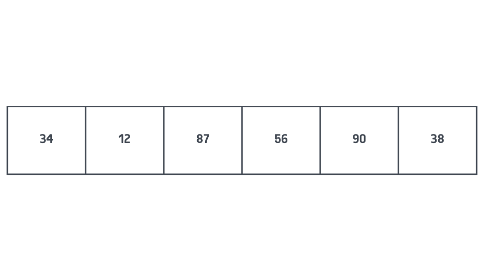
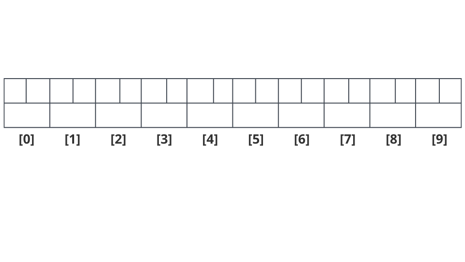
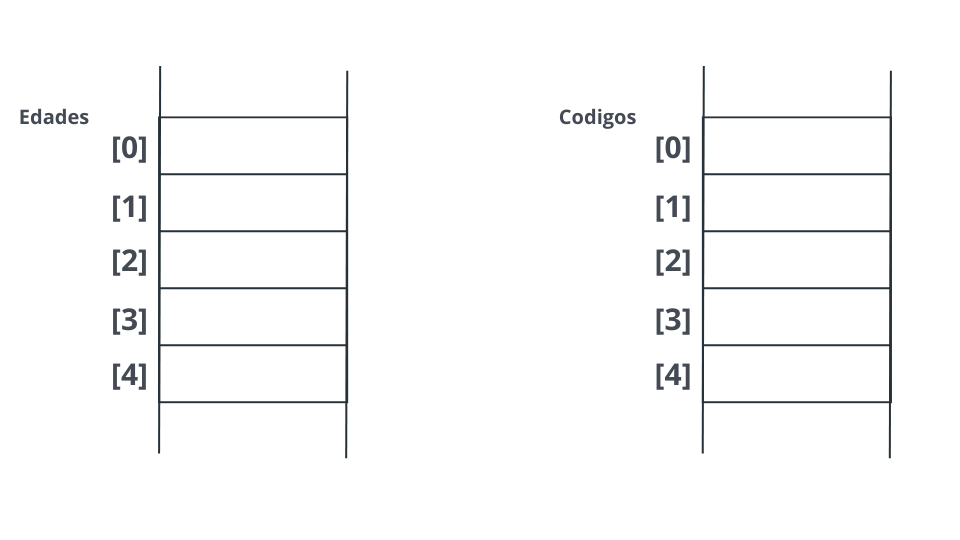
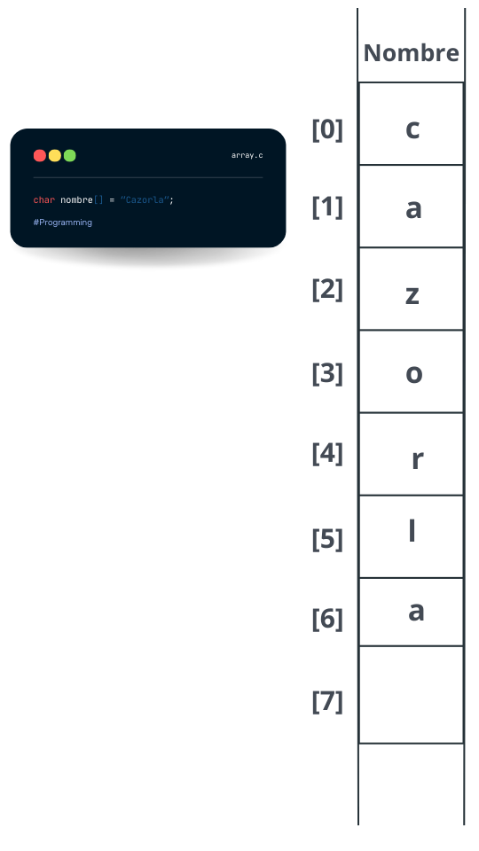
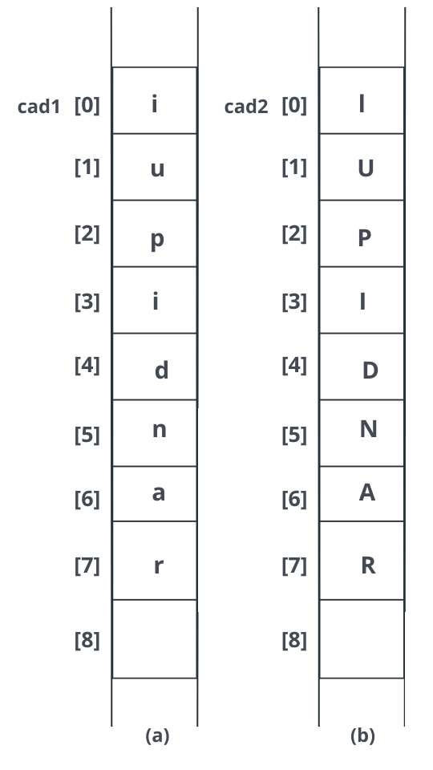
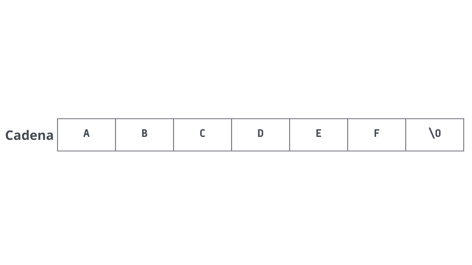
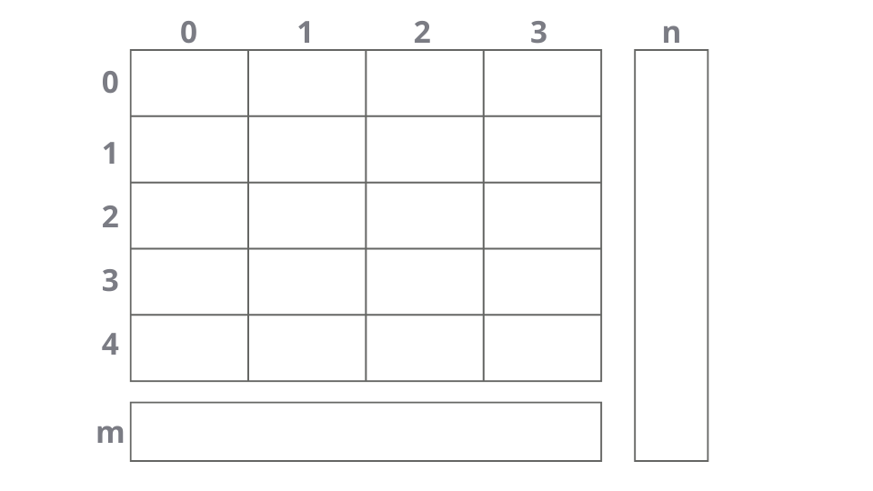

## Temario
1. [Array (Lista, Tabla)](#IArray-(Lista,-Tabla)ntroducción)
2. [Inicialización de un array](#Inicialización-de-un-array)
3. [Array de caracteres y cadenas de texto](#Array-de-caracteres-y-cadenas-de-texto)
4. [Arrays Multidimensionales](#Arrays-Multidimensionales)
5. [UTILIZACIÓN DE ARRAYS COMO PARÁMETROS](#UTILIZACIÓN-DE-ARRAYS-COMO-PARÁMETROS)
6. [ORDENACIÓN DE LISTAS](#ORDENACIÓN-DE-LISTAS)
7. [BÚSQUEDA EN LISTAS](#BÚSQUEDA-EN-LISTAS)

## Array (Lista, Tabla)

Un array (lista o tabla) es una secuencia de datos del mismo tipo. Los datos se llaman elementos del array y se numeran consecutivamente 0, 1, 2, 3, etc. El tipo de elementos almacenados en el array puede ser cualquier tipo de dato de C, incluyendo estructuras definidas por el usuario, como se describirá más tarde. Normalmente, el array se utiliza para almacenar tipos tales como char, int o float.

Un array puede contener, por ejemplo, la edad de los alumnos de una clase, las temperaturas de cada día de un mes en una ciudad determinada, o el número de personas que residen en cada una de las diecisiete comunidades autónomas españolas. Cada ítem del array se denomina elemento.

Los elementos de un array se numeran, como ya se ha comentado, consecutivamente 0, 1, 2, 3, ... Estos números se denominan valores índice o subíndice del array. El término "subíndice" se utiliza ya que se especifica igual que en matemáticas, como una secuencia tal como a_sub_0, a_2, a_3... Estos números localizan la posición del elemento dentro del array, proporcionando acceso directo al array.

Si el nombre del array es `a`, entonces `a[0]` es el nombre del elemento que está en la posición 0, `a[1]` es el nombre del elemento que está en la posición 1, etc. En general, el elemento i-ésimo está en la posición i-1. De modo que si el array tiene n elementos, sus nombres son `a[0]`, `a[1]`, ..., `a[n-1]`. Gráficamente se representa así el array `a` con seis elementos.


**Figura Array de seis elementos.**


El array `a` tiene 6 elementos: `a[0]` contiene 34, `a[1]` contiene 12, `a[2]` contiene 87, `a[3]` contiene 56, `a[4]` contiene 90 y `a[5]` contiene 38. El diagrama de la Figura  representa realmente una región de la memoria de la computadora, ya que un array se almacena siempre con sus elementos en una secuencia de posiciones de memoria contigua.

En C, los índices de un array siempre tienen como límite inferior 0 y como índice superior el tamaño del array menos 1.

### Declarción de un array

Al igual que con cualquier tipo de variable, se debe declarar un array antes de utilizarlo. Un array se declara de modo similar a otros tipos de datos, excepto que se debe indicar al compilador el tamaño o longitud del array. Para indicar al compilador el tamaño o longitud del array, se debe hacer seguir al nombre, el tamaño encerrado entre corchetes. La sintaxis para declarar un array de una dimensión determinada es:

```c
tipo nombreArray[numeroDeElementos];
```

Por ejemplo, para crear un array (lista) de diez variables enteras, se escribe:

```c
int numeros[10];
```

Esta declaración hace que el compilador reserve espacio suficiente para contener diez valores enteros. En C, los enteros ocupan, normalmente, 2 bytes, de modo que un array de diez enteros ocupa 20 bytes de memoria. La Figura muestra el esquema de un array de diez elementos; cada elemento puede tener su propio valor.

**Array de datos enteros:**



Un array de enteros se almacena en bytes consecutivos de memoria. Cada elemento utiliza dos bytes. Se accede a cada elemento de array mediante un índice que comienza en cero. Así, el elemento quinto (`a[4]`) del array ocupa los bytes 9 y 10. La Figura muestra el almacenamiento de un array en memoria.

Se puede acceder a cada elemento del array utilizando un índice en el nombre del array. Por ejemplo:

```c
printf("%d\n", numeros[4]);
```

Visualiza el valor del elemento 5 del array. Los arrays siempre comienzan en el elemento 0. Así pues, el array `numeros` contiene los siguientes elementos individuales:

```c
numeros[0] numeros[1] numeros[2] numeros[3] numeros[4] numeros[7] numeros[8] numeros[9]
```

Si, por ejemplo, se quiere crear un array de números reales y su tamaño es una constante representada por un parámetro `#define N 20`, se puede hacer:

```c
float vector[N];
```

Para acceder al elemento 3 y leer un valor de entrada:

```c
scanf("%f", &vector[2]);
```

***Precaución***

***En C, no se comprueba automáticamente que los índices del array estén dentro del rango definido. Por ejemplo, se puede intentar acceder a `numeros[12]` y el compilador no producirá ningún error, lo que puede resultar en un fallo en su programa, dependiendo del contexto en el que se encuentre el error.***


### Subíndices de un array

El índice de un array se denomina, con frecuencia, subíndice del array. El término procede de las matemáticas, donde un subíndice se utiliza para representar un elemento determinado.

```c
numeros[0] equivale a numeros[0] 
numeros[3] equivale a numeros[13]
```

El método de numeración del elemento i-ésimo con el índice o subíndice i-1 se denomina indexación basada en cero. Su uso tiene el efecto de que el índice de un elemento del array es siempre el mismo que el número de "pasos" desde el elemento inicial hasta ese elemento. Por ejemplo, `a[3]` está a 3 pasos o posiciones del elemento `a[0]`. La ventaja de este método se verá de modo más evidente al tratar las relaciones entre arrays y punteros.

**Ejemplos**

```c
int edad[5]; // Array edad contiene 5 elementos: el primero, edad[0] y el último, edad[4].
```

Declara 2 arrays de enteros.
```c
int pesos[25], longitudes[100];
```

Declara un array de 25 elementos float.
```c
float salarios[25];
```

Declara un array de 50 elementos double.
```c
double temperaturas[50];
```

Declara un array de caracteres.
```c
char letras[15];
```

Usando una constante `MX` definida con `#define`.
```c
#define MX 120
char buffer[MX + 1]; // Declara un array de caracteres de tamaño MX + 1, el primer elemento es buffer[0] y el último buffer[MX].
```

En los programas se pueden referenciar elementos del array utilizando fórmulas para los subíndices. Mientras que el subíndice puede evaluar a un entero, se puede utilizar una constante, una variable o una expresión para el subíndice. Así, algunas referencias individuales a elementos son:

```c
edad[4]
ventas[total + 5]
bonos[mes]
salario[mes][i * 5]
```

### **Almacenamiento en memoria de los arrays**

Los elementos de los arrays se almacenan en bloques contiguos. Así, por ejemplo, los arrays:

```c
int edades[5];
char codigos[5];
```

se representan gráficamente en memoria en la Figura.



Almacenamiento en memoria de arrays.**

**Nota:**
Todos los subíndices de los arrays comienzan con 0.

**Precaución:**
C permite asignar valores fuera de rango a los subíndices. Se debe tener cuidado de no realizar esta acción, ya que se podrían sobrescribir datos o código.

Los arrays de caracteres funcionan de igual forma que los arrays numéricos, partiendo de la base de que cada carácter ocupa normalmente un byte. Así, por ejemplo, un array llamado `nombre` se puede representar en la Figura.



**Almacenamiento de un array de caracteres en memoria.**

**A tener en cuenta:** En las cadenas de caracteres, el sistema siempre inserta un último carácter (nulo) para indicar fin de cadena.

### **El tamaño de los arrays**

El operador `sizeof` devuelve el número de bytes necesarios para contener su argumento. Si se usa `sizeof` para solicitar el tamaño de un array, esta función devuelve el número de bytes reservados para el array completo.

Por ejemplo, supongamos que se declara un array de enteros de 100 elementos denominado `edades`; si se desea conocer el tamaño del array, se puede utilizar una sentencia similar a:

```c
n = sizeof(edades);
```

Donde `n` tomará el valor 400 (si un entero ocupa 4 bytes). Si se desea solicitar el tamaño de un elemento individual del array, tal como:

```c
n = sizeof(edades[6]);
```

`n` almacenará el valor 4 (número de bytes que contienen un entero).

**8.1.5. Verificación del rango del índice de un array**

C, al contrario que otros lenguajes de programación, por ejemplo, Pascal, no verifica el valor del índice de la variable que representa al array. Así, por ejemplo, en Pascal si se define un array `a` con índices 0 a 5, entonces `a[6]` hará que el programa se "rompa" en tiempo de ejecución.

**Ejemplo 8.1**

Protección frente a errores en el intervalo (rango) de valores de una variable de índice que representa un array.

```c
double suma(const double a[], const int n) {
    double S = 0.0;
    if (n * sizeof(double) > sizeof(a)) {
        for (int i = 0; i < n; i++) {
            S += a[i];
        }
        return S;
    }
    return 0;
}
```

## Inicialización de un array

Se deben asignar valores a los elementos del array antes de utilizarlos, tal como se asignan valores a variables. Para asignar valores a cada elemento del array de enteros `precios`, se puede escribir:

```c
precios[0] = 10;
precios[1] = 20;
precios[2] = 30;
precios[4] = 40;
...
```

La primera sentencia fija `precios[0]` al valor 10, `precios[1]` al valor 20, etc. Sin embargo, este método no es práctico cuando el array contiene muchos elementos. El método utilizado normalmente es inicializar el array completo en una sola sentencia.

Cuando se inicializa un array, el tamaño del array se puede determinar automáticamente por las constantes de inicialización. Estas constantes se separan por comas y se encierran entre llaves, como en los siguientes ejemplos:

```c
int numeros[6] = {10, 20, 30, 40, 50, 60};
int n[3] = {3, 4, 5}; // Declara un array de 3 elementos
char c[4] = {'L', 'u', 'i', 's'}; // Declara un array de 4 elementos
```

El array `numeros` tiene 6 elementos, `n` tiene 3 elementos y el array `c` tiene 4 elementos.

**Nota:** En C, los arrays de caracteres, las cadenas, se caracterizan por tener un carácter final que indica el fin de la cadena, es el carácter nulo. Lo habitual es inicializar un array de caracteres (una variable cadena) con una constante cadena.

```c
char s[] = "Puesta del Sol";
```

**Nota:** Pueden usarse corchetes vacíos, solo cuando se asignan valores al array.

```c
int cuenta[] = {15, 25, -45, 0, 50};
```

El compilador asigna automáticamente cinco elementos a `cuenta`.

El método de inicializar arrays mediante valores constantes después de su definición es adecuado cuando el número de elementos del array es pequeño. Por ejemplo, para inicializar un array (lista) de 10 enteros a los valores 10 a 1, y a continuación visualizar dichos valores en un orden inverso, se puede escribir:

```c
int cuenta[10] = {10, 9, 8, 7, 6, 5, 4, 3, 2, 1};
for (i = 9; i >= 0; i--)
    printf("\n cuenta descendente %d = %d", i, cuenta[i]);
```

Se pueden asignar constantes simbólicas como valores numéricos, de modo que las siguientes sentencias son válidas:

```c
#define ENE 31
#define FEB 28
#define MAR 31
int meses[12] = {ENE, FEB, MAR, ABR, MAY, JUN, JUL, AGO, SEP, OCT, NOV, DIC};
```

Pueden asignarse valores a un array utilizando un bucle `for` o `while/do-while`, y este suele ser el sistema más empleado normalmente. Por ejemplo, para inicializar todos los valores del array `numeros` al valor 0, se puede utilizar la siguiente sentencia:

```c
for (i = 0; i <= 5; i++)
    numeros[i] = 0;
```

Debido a que el valor del subíndice `i` varía de 0 a 5, cada elemento del array `numeros` se inicializa y establece a cero.

**Ejemplo 8.2**

El programa `INICIALI.C` lee ocho enteros; a continuación, visualiza el total de los números.

```c
#include <stdio.h>
#define NUM 8

int main() {
    int nums[NUM];
    int i;
    int total = 0;

    for (i = 0; i < NUM; i++) {
        printf("Por favor, introduzca el número: ");
        scanf("%d", &nums[i]);
    }

    printf("\nLista de números: ");
    for (i = 0; i < NUM; i++) {
        printf("%d ", nums[i]);
        total += nums[i];
    }

    printf("\nLa suma de los números es %d", total);
    return 0;
}
```

Las variables globales que representan arrays se inicializan a 0 por defecto. Por ello, la ejecución del siguiente programa visualiza 0 para los 10 valores del array:

```c
int lista[10];

int main() {
    int j;

    for (j = 0; j <= 9; j++)
        printf("\n lista[%d] = %d", j, lista[j]);

    return 0;
}
```

Así, por ejemplo, en:

```c
int Notas[5];
static char Nombres[5];
```

Si se define un array globalmente o un array estático y no se proporciona ningún valor de inicialización, el compilador inicializará el array con un valor por defecto (cero para arrays de elementos enteros y reales -coma flotante- y carácter nulo para arrays de caracteres).

   Notas                                             Nombres
[0] 0                                                 101 ´\0´
[1] 0                                                 [1] ´\0´
[2] 0                                                 [2] ´\0´
[3] 0                                                 [3] ´\0´
[4] 0                                                 [4] ´\0´


## Array de caracteres y cadenas de texto

Una cadena de texto es un conjunto de caracteres, tales como "ABCDEFG". C soporta cadenas de texto utilizando un array de caracteres que contenga una secuencia de caracteres:

```c
char cadena[] = "ABCDEFG";
```

Es importante comprender la diferencia entre un array de caracteres y una cadena. Las cadenas contienen un carácter nulo al final del array de caracteres.






```c
Cadena[3] = 'D';
Cadena[4] = 'E';
Cadena[5] = 'F';
Cadena[6] = '\0';
```

Sin embargo, no se puede asignar una cadena a un array del siguiente modo:

```c
Cadena = "ABCDEF";
```

Para copiar una constante cadena o copiar una variable de cadena a otra variable de cadena, se debe utilizar la función de la biblioteca estándar `strcpy()` ("copiar cadenas"). `strcpy()` permite copiar una constante de cadena en una cadena. Para copiar el nombre "Abracadabra" en el array `nombre`, se puede escribir:

```c
strcpy(nombre, "Abracadabra"); /* Copia Abracadabra en nombre */
```

`strcpy()` añade un carácter nulo al final de la cadena. A fin de evitar errores en la sentencia anterior, se debe asegurar que el array de caracteres `nombre` tenga elementos suficientes para contener la cadena situada a su derecha.

**Ejemplo 8.3**

Rellenar los elementos de un array con números reales positivos procedentes del teclado.

```c
#include <stdio.h>

/* Constantes y variables globales */
#define MAX 10
float muestra[MAX];

void main() {
    int i;
    printf("\nIntroduzca una lista de %d elementos positivos.\n", MAX);
    for (i = 0; i < MAX; muestra[i] > 0 ? ++i : i)
        scanf("%f", &muestra[i]);
}
```

En el bucle principal, solo se incrementa `i` si `muestra[i]` es positivo: `muestra[i] > 0 ? ++i : i`. Con este incremento condicional, se garantiza que todos los valores almacenados sean positivos.

**Ejemplo 8.4**

Visualizar el array `muestra` después de introducir datos en el mismo, separándolos con el tabulador.

```c
#include <stdio.h>
#define MAX 10
float muestra[MAX];

void main() {
    int i;
    printf("\nIntroduzca una lista de %d elementos positivos.\n", MAX);
    for (i = 0; i < MAX; muestra[i] > 0 ? ++i : i)
        scanf("%f", &muestra[i]);
    printf("\nDatos leídos del teclado: ");
    for (i = 0; i < MAX; ++i)
        printf("%f\t", muestra[i]);
}
```

## Arrays Multidimensionales

Los arrays vistos anteriormente se conocen como arrays unidimensionales (una sola dimensión) y se caracterizan por tener un solo subíndice. Estos arrays se conocen también por el término listas. Los arrays multidimensionales son aquellos que tienen más de una dimensión y, en consecuencia, más de un índice. Los arrays más usuales son los de dos dimensiones, conocidos también por el nombre de tablas o matrices. Sin embargo, es posible crear arrays de tantas dimensiones como requieran sus aplicaciones, esto es, tres, cuatro o más dimensiones.

Un array de dos dimensiones equivale a una tabla con múltiples filas y múltiples columnas (Fig. 8.6).




Obsérvese que en el array bidimensional de la Figura 8.6, si las filas se etiquetan de 0 a m y las columnas de 0 a n, el número de elementos que tendrá el array será el resultado del producto (m+1) x (n+1). El sistema de localizar un elemento será por las coordenadas representadas por su número de fila y su número de columna (a, b). La sintaxis para la declaración de un array de dos dimensiones es:

```c
<tipo de datoElemento> <nombre array>[<NúmeroDeFilas>][<NúmeroDeColumnas>];
```

Algunos ejemplos de declaración de tablas:

```c
char Pantalla[25][80];
int puestos[6][8];
int equipos[4][30];
int matriz[4][2];
```

**Atención:**
Al contrario que otros lenguajes, C requiere que cada dimensión esté encerrada entre corchetes. La sentencia

```c
int equipo[4, 30];
```

no es válida.

Un array de dos dimensiones en realidad es un array de arrays. Es decir, es un array unidimensional, y cada elemento no es un valor entero, o de coma flotante o carácter, sino que cada elemento es otro array.

Los elementos de los arrays se almacenan en memoria de modo que el subíndice más próximo al nombre del array es la fila y el otro subíndice, la columna. En la Tabla 8.1 se representan todos los elementos y sus posiciones relativas en memoria del array, int tabla[4][2], suponiendo que cada entero ocupa 2 bytes.


**8.4.1. Inicialización de arrays multidimensionales**

Los arrays multidimensionales se pueden inicializar, al igual que los de una dimensión, cuando se declaran. La inicialización consta de una lista de constantes separadas por comas y encerradas entre llaves, como en los ejemplos siguientes:

1. `int tabla[2][3] = {5, 6, 7, 8, 9, 10};`
   o bien en los formatos más amigables:
2. `int tabla[2][3] = {{5, 6, 7}, {8, 9, 10}};`
3. `int tabla[2][3] = { {5, 6, 7}, {8, 9, 10} };`

![Figura 8.8. Almacenamiento en memoria de tabla[3][4].](imagen_8_8.png)

**8.4.2. Acceso a los elementos de los arrays bidimensionales**

Se puede acceder a los elementos de arrays bidimensionales de igual forma que a los elementos de un array unidimensional. La diferencia reside en que en los elementos bidimensionales deben especificarse los índices de la fila y la columna.

El formato general para asignación directa de valores a los elementos es:

```c
<nombre array>[indice fila][indice columna] = valor elemento;
```

y para la extracción de elementos:

```c
<variable> = <nombre array>[indice fila][indice columna];
```

Algunos ejemplos de inserciones:

```c
tabla[2][3] = 4.5;
resistencias[1][4] = 50;
AsientosLibres[5][12] = 5;
```

y de extracción de valores:

```c
Ventas = Tabla[1][1];
Dia = Semana[3][6];
```

**8.4.3. Lectura y escritura de elementos de arrays bidimensionales**

Las funciones de entrada o salida se aplican de igual forma a los elementos de un array bidimensional. Por ejemplo:

```c
int tabla[3][4];
double resistencias[4][5];

scanf("%d", &tabla[2][3]);
printf("%4d", tabla[1][1]);

scanf("%lf", &resistencias[2][4]);
if (asientosLibres[3][1])
    // ...
else
    // ...
```

**8.

4.4. Acceso a elementos mediante bucles**

Se puede acceder a los elementos de arrays bidimensionales mediante bucles anidados. Su sintaxis es:

```c
int IndiceFila, IndiceCol;
for (IndiceFila = 0; IndiceFila < NumFilas; ++IndiceFila)
    for (IndiceCol = 0; IndiceCol < NumCol; ++IndiceCol)
        Procesar elemento[IndiceFila][IndiceCol];
```

**Ejemplo 8.9:**
Definir una tabla de discos, rellenar la tabla con datos de entrada y mostrarlos en pantalla.

```c
float discos[2][4];
int fila, col;
for (fila = 0; fila < 2; fila++)
    for (col = 0; col < 4; col++)
        scanf("%f", &discos[fila][col]);

// Visualizar la tabla
for (fila = 0; fila < 2; fila++)
    for (col = 0; col < 4; col++)
        printf("\n Pts %.lf \n", discos[fila][col]);
```

**Ejercicio 8.1:**
Lectura y visualización de un array de dos dimensiones. La función `leer()` lee un array (una tabla) de dos dimensiones y la función `visualizar()` presenta la tabla en la pantalla.

```c
#include <stdio.h>

/* prototipos */
void leer(int a[3][5]);
void visualizar(const int a[3][5]);

int main() {
    int a[3][5];
    leer(a);
    visualizar(a);
    return 0;
}

void leer(int a[3][5]) {
    int i, j;
    puts("Introduzca 15 números enteros, 3 por fila");
    for (i = 0; i < 3; i++) {
        printf("Fila %d: ", i);
        for (j = 0; j < 5; j++)
            scanf("%d", &a[i][j]);
    }
}

void visualizar(const int a[3][5]) {
    int i, j;
    for (i = 0; i < 3; i++) {
        printf("Fila %d: ", i);
        for (j = 0; j < 5; j++)
            printf("%d ", a[i][j]);
        printf("\n");
    }
}
```
### Arrays de más de dos dimensiones

C proporciona la posibilidad de almacenar varias dimensiones, aunque raramente los datos del mundo real requieren más de dos o tres dimensiones. El medio más fácil de visualizar un array de tres dimensiones es imaginando un cubo, como se muestra en la Figura 8.10.

Un array tridimensional se puede considerar como un conjunto de arrays bidimensionales combinados para formar, en profundidad, una tercera dimensión. El cubo se construye con filas (dimensión vertical), columnas (dimensión horizontal) y planos (dimensión en profundidad). Por lo tanto, un elemento dado se localiza especificando su plano, fila y columna. Una definición de un array tridimensional equipos es:

```c
int equipos[3][15][10];
```

Un ejemplo típico de un array de tres dimensiones es el modelo de un libro, donde cada página del libro es un array bidimensional construido por filas y columnas. Por ejemplo, cada página tiene cuarenta y cinco líneas que forman las filas del array y ochenta caracteres por línea que forman las columnas del array. Si el libro tiene quinientas páginas, existirán quinientos planos y el número de elementos será 500 x 80 x 45 = 1,800,000.


**8.4.6. Una aplicación práctica**

El array libro tiene tres dimensiones [PAGINAS] [LINEAS] [COLUMNAS], que definen el tamaño del array. El tipo de datos del array es `char`, ya que los elementos son caracteres.

¿Cómo se puede acceder a la información del libro? El método más fácil es mediante bucles anidados. Dado que el libro se compone de un conjunto de páginas, el bucle más externo será el bucle de página, y el bucle de columnas será el bucle más interno. Esto significa que el bucle de filas se insertará entre los bucles de página y columna. El código siguiente permite procesar el array:

```c
int pagina, linea, columna;
for (pagina = 0; pagina < PAGINAS; ++pagina)
    for (linea = 0; linea < LINEAS; ++linea)
        for (columna = 0; columna < COLUMNAS; ++columna)
            <procesar Libro[pagina][linea][columna]>
```

**Ejercicio 8.2**

Comprobar si una matriz de números enteros es simétrica respecto a la diagonal principal. La matriz se genera internamente, con la función `rand()` y el argumento `N(8)` para que la matriz tenga valores de 0 a 7. El tamaño de la matriz se pide como dato de entrada. La función `simetrica()` determina si la matriz es simétrica. La función `main()` genera matrices hasta encontrar una que sea simétrica y la escribe en pantalla.

```c
/*
Determina si una matriz es simétrica. La matriz se genera con números 
aleatorios de 0 a 7. El programa itera hasta encontrar una matriz 
simétrica.
*/
#include <stdlib.h>
#include <stdio.h>
#include <time.h>
#define N 8

void genmat(int a[][N], int n);
int simetrica(int a[][N], int n);
void escribemat(int a[][N], int n);

int main(void) {
    int a[N][N]; /* define matriz de tamaño máximo N */
    int n, i, j;
    int es_sim;

    srand(time(NULL));

    do {
        printf("\nTamaño de cada dimensión de la matriz, máximo %d: ", N);
        scanf("%d", &n);
    } while (n < 2 || n > N);

    do {
        genmat(a, n);
        es_sim = simetrica(a, n);
        if (es_sim) {
            puts("\nEncontrada matriz simétrica.\n");
            escribemat(a, n);
        }
    } while (!es_sim);

    return 0;
}

void genmat(int a[][N], int n) {
    int i, j;
    for (i = 0; i < n; i++)
        for (j = 0; j < n; j++)
            a[i][j] = rand() % N;
}

int simetrica(int a[][N], int n) {
    int i, j;
    int es_simetrica = 1;

    for (i = 0; i < n - 1 && es_simetrica; i++) {
        for (j = i + 1; j < n && es_simetrica; j++) {
            if (a[i][j] != a[j][i])
                es_simetrica = 0;
        }
    }
    return es_simetrica;
}

void escribemat(int a[][N], int n) {
    int i, j;
    puts("\tMatriz analizada");
    for (i = 0; i < n; i++) {
        putchar('\t');
        puts("\t-- \n");
        for (j = 0; j < n; j++)
            printf("%d%c", a[i][j], (j == n - 1 ? '\n' : ' '));
    }
}
```

## UTILIZACIÓN DE ARRAYS COMO PARÁMETROS

En C, todos los arrays se pasan por referencia (dirección). Esto significa que cuando se llama a una función y se utiliza un array como parámetro, se debe tener cuidado de no modificar los arrays en una función llamada. C trata automáticamente la llamada a la función como si hubiera situado el operador de dirección `&` delante del nombre del array. La Figura 8.11 ayuda a comprender el mecanismo.

Dadas las declaraciones:

```c
#define MAX 100
double datos[MAX];
```

se puede declarar una función que acepte un array de valores double como parámetro. La función `SumaDeDatos()` puede tener el prototipo:

```c
double SumaDeDatos(double datos[MAX]);
```

Incluso mejor, si se dejan los corchetes en blanco y se añade un segundo parámetro que indica el tamaño del array:

```c
double SumaDeDatos(double datos[], int n);
```

```c
int main() {
    char palabra[4] = "AB(:";
    cambiar_palabra(palabra);
    puts(palabra);
    return 0;
}
```

**Figura 8.11. Paso de un array por dirección.**

A la función `SumaDeDatos` se le pueden pasar argumentos de tipo array junto con un entero `n`, que informa a la función sobre cuántos valores contiene el array. Por ejemplo, esta sentencia visualiza la suma de valores de los datos del array:

```c
printf("\nSuma = %lf", SumaDeDatos(datos, MAX));
```

La función `SumaDeDatos` no es difícil de escribir. Un simple bucle `for` suma los elementos del array y una sentencia `return` devuelve el resultado de nuevo al llamador:

```c
double SumaDeDatos(double datos[], int n) {
    double suma = 0;
    while (n > 0)
        suma += datos[--n];
    return suma;
}
```

El código que se utiliza para pasar un array a una función incluye el tipo de elemento del array y su nombre. El siguiente ejemplo incluye dos funciones que procesan arrays. En ambas listas de parámetros, el array `a[]` se declara en la lista de parámetros tal como:

```c
double a[];
```

El número real de elementos se pasa mediante una variable entera independiente. Cuando se pasa un array a una función, se pasa realmente sólo la dirección de la celda de memoria donde comienza el array. Este valor se representa por el nombre del array `a[]`. La función puede cambiar entonces el contenido del array accediendo directamente a las celdas de memoria en donde se almacenan los elementos del array. Así, aunque el nombre del array se pasa por valor, sus elementos se pueden cambiar como si se hubieran pasado por referencia.

**Ejemplo 8.5**

Paso de arrays a funciones. En el ejemplo se lee un array y se escribe. El array tiene un tamaño máximo, `L`, aunque el número real de elementos es determinado en la función `leerArray()`. El segundo argumento es, por tanto, un puntero para así poder transmitir por referencia y obtener dicho dato de la función.

```c
#include <stdio.h>
#define L 100

void leerArray(double a[], int* num);
void imprimirArray(const double a[], int n);

int main() {
    double a[L];
    int n;
    leerArray(a, &n);
    printf("El array a tiene %d elementos, estos son\n", n);
    imprimirArray(a, n);
    return 0;
}

void leerArray(double a[], int* num) {
    int n = 0;
    puts("Introduzca datos. Para terminar pulsar 0.\n");
    for (; n < L; n++) {
        printf("%d: ", n);
        scanf("%lf", &a[n]);
        if (a[n] == 0) break;
    }
    *num = n;
}

void imprimirArray(const double a[], int n) {
    int i = 0;
    for (; i < n; i++)
        printf("\t%d: %lf\n", i, a[i]);
}
```

**Ejercicio 8.2**

Escribir una función que calcule el máximo de los primeros `n` elementos de un array especificado.

```c
double maximo(const double a[], int n) {
    double mx;
    int i;
    mx = a[0];
    for (i = 1; i < n; i++)
        mx = (a[i] > mx ? a[i] : mx);
    return mx;
}
```

**8.5.1. Precauciones**

Cuando se utiliza una variable array como argumento, la función receptora puede no conocer cuántos elementos existen en el array. Sin su conocimiento, una función no puede utilizar el array. Aunque la variable array puede apuntar al comienzo de él, no proporciona ninguna indicación de dónde termina el array.

La función `SumaDeEnteros()` suma los valores de todos los elementos de un array y devuelve el total.

```c
int main() {
    int lista[] = {10, 11, 12, 13, 14};
    SumaDeEnteros(lista);
    return 0;
}
```

Aunque `SumaDeEnteros()` conoce dónde comienza el array, no conoce cuántos elementos hay en el array; en consecuencia, no sabe cuántos elementos hay que sumar.

Se pueden utilizar dos métodos alternativos para permitir que una función conozca el número de argumentos asociados con un array que se pasa como argumento de una función:

1. Situar un valor de señal al final del array, que indique a la función que se ha de detener el proceso en ese momento.
2. Un segundo argumento que indica el número de elementos del array.

Todas las cadenas utilizan el primer método ya que terminan en nulo. Una segunda alternativa es pasar el número de elementos del array siempre que se pasa el array como un argumento. El array y el número de elementos se convierten entonces en una pareja de argumentos que se asocian con la función llamada. La función `SumaDeEnteros()`, por ejemplo, se puede actualizar así:

```c
int SumaDeEnteros(int ArrayEnteros[], int NoElementos) {
    // cuerpo de la función SumaDeEnteros
}
```

El segundo argumento, `NoElementos`, es un valor entero que indica a la función `SumaDeEnteros()` cuántos elementos se procesarán en el array `ArrayEnteros`. Este método suele ser el utilizado para arrays de elementos que no son caracteres.

**Ejemplo 8.6**

Este programa introduce una lista de 10 números enteros y calcula su suma y el valor máximo.

```c
#include

 <stdio.h>

int SumaDeEnteros(const int ArrayEnteros[], int NoElementos);
int maximo(const int ArrayEnteros[], int NoElementos);

int main() {
    int items[10];
    int Total, i;
    puts("Introduzca 10 números, seguidos por return");
    for (i = 0; i < 10; i++)
        scanf("%d", &items[i]);
    printf("Total = %d\n", SumaDeEnteros(items, 10));
    printf("Valor máximo: %d\n", maximo(items, 10));
    return 0;
}

int SumaDeEnteros(const int ArrayEnteros[], int NoElementos) {
    int i, Total = 0;
    for (i = 0; i < NoElementos; i++)
        Total += ArrayEnteros[i];
    return Total;
}

int maximo(const int ArrayEnteros[], int NoElementos) {
    int mx;
    int i;
    mx = ArrayEnteros[0];
    for (i = 1; i < NoElementos; i++)
        mx = (ArrayEnteros[i] > mx ? ArrayEnteros[i] : mx);
    return mx;
}
```

El siguiente programa muestra cómo se pasa un array de enteros a una función de ordenación:

```c
#include <stdio.h>

void ordenar(int lista[], int numElementos); /* prototipo de ordenar */

int main() {
    int ListaEnt[] = {9, 8, 7, 6, 5, 4, 3, 2, 1, 10};
    int i;
    int LongLista = sizeof(ListaEnt) / sizeof(int);
    ordenar(ListaEnt, LongLista);
    for (i = 0; i < LongLista; i++)
        printf("%d ", ListaEnt[i]);
    return 0;
}

void ordenar(int lista[], int numElementos) {
    /* cuerpo de la función para ordenar el array */
}
```

Como C trata las cadenas como arrays de caracteres, las reglas para pasar arrays como argumentos a funciones se aplican también a cadenas. El siguiente ejemplo de una función de cadena `conviertemayus()` que convierte los caracteres de sus argumentos a mayúsculas, muestra el paso de parámetros tipo cadena.

```c
void conviertemayus(char cad[]) {
    int i = 0;
    int intervalo = 'a' - 'A';
    while (cad[i]) {
        cad[i] = (cad[i] >= 'a' && cad[i] <= 'z') ? cad[i] - intervalo : cad[i];
        i++;
    }
}
```

La función `conviertemayus()` recibe una cadena, un array de caracteres cuyo último carácter es el nulo (`'\0'`). El bucle termina cuando se alcance el fin de cadena (nulo, condición `false`). La condición del operador ternario determina si el carácter es minúscula, en cuyo caso resta a dicho carácter el intervalo que hay entre las minúsculas y las mayúsculas.

### **Paso de cadenas como parámetros**

La técnica de pasar arrays como parámetros se utiliza para pasar cadenas de caracteres a funciones. Las cadenas terminadas en nulo utilizan el primer método dado anteriormente para controlar el tamaño de un array. Las cadenas son arrays de caracteres. Cuando una cadena se pasa a una función, tal como `str1en()` (véase el capítulo de tratamiento de cadenas), la función conoce que se ha almacenado el final del array cuando ve un valor de 0 en un elemento del array.

Las cadenas utilizan siempre un 0 para indicar que es el último elemento del array de caracteres. Este 0 es el carácter nulo del código de caracteres ASCII.

Considérese estas declaraciones de una constante y una función que acepta un parámetro cadena y un valor de su longitud.

```c
#define MAXLON 128
void FuncDemo(char s[], int long);
```

El parámetro `s` es un array de caracteres de longitud no especificada. El parámetro `long` indica a la función cuántos bytes ocupa (que puede ser diferente del número de caracteres almacenados en `s`).

Dadas las declaraciones siguientes:

```c
char presidente[MAXLON] = "Manuel Martinez";
FuncDemo(presidente, MAXLON);
```

la primera línea declara e inicializa un array de caracteres llamado `presidente`, capaz de almacenar hasta `MAXLON-1` caracteres más un byte de terminación, carácter nulo. La segunda línea pasa la cadena a la función.

## ORDENACIÓN DE LISTAS

La ordenación de arrays es otra de las tareas usuales en la mayoría de los programas. La ordenación o clasificación es el procedimiento mediante el cual se disponen los elementos del array en un orden especificado, tal como orden alfabético u orden numérico.

Un diccionario es un ejemplo de una lista ordenada alfabéticamente, y una agenda telefónica o lista de cuentas de un banco es un ejemplo de una lista ordenada numéricamente. El orden de clasificación u ordenación puede ser ascendente o descendente.

Existen numerosos algoritmos de ordenación de arrays: inserción, burbuja, selección, rápido (quick sort), fusión (merge), montículo (heap), shell, etc.

**8.6.1. Algoritmo de la burbuja**

La ordenación por burbuja es uno de los métodos más fáciles de ordenación. El método (algoritmo) de ordenación es muy simple. Se compara cada elemento del array con el siguiente (por parejas), si no están en el orden correcto, se intercambian entre sí sus valores. El valor más pequeño flota hasta la parte superior del array como si fuera una burbuja en un vaso de refresco con gas.

La Figura 8.13 muestra una lista de números, antes, durante las sucesivas comparaciones y a la terminación del algoritmo de la burbuja. Se van realizando diferentes pasadas hasta que la lista se encuentra ordenada totalmente en orden ascendente.

```c
Lista desordenada: 6 4 10 2 8
Primera pasada
4 6 6 6
10 10 2 2
2 2 10 8
8 8 8 10
Segunda pasada
4 4 6 2 2 6 8 8 10 10
Tercera pasada
4 2 2 4 6 6 8 8 10 10
Cuarta pasada
2 4 4 6 6 8 8 10 10
```

La ordenación de arrays requiere siempre un intercambio de valores cuando éstos no se encuentran en el orden previsto. Si, por ejemplo, en la primera pasada 6 y 4 no están ordenados, se han de intercambiar sus valores. Suponiendo que el array se denomina lista:

```c
lista[0] = 6;
lista[1] = 4;
```

Para intercambiar dos valores, se necesita utilizar una tercera variable auxiliar que contenga el resultado inmediato. Así, por ejemplo, si las dos variables son `lista[0]` y `lista[1]`, el siguiente código realiza el intercambio de dos variables:

**Ejemplo 8.7**

La función `intercambio` intercambia los valores de dos variables `x` e `y`. El algoritmo de intercambio utiliza una variable auxiliar.

```c
float aux;
aux = x;
x = y;
y = aux;
```

La función `intercambio` sirve para intercambiar dos elementos `x` e `y` que se pasan a ella. Al tener que pasar por referencia, los argumentos de la función son punteros.

```c
void intercambio(float* x, float* y) {
    float aux;
    aux = *x;
    *x = *y;
    *y = aux;
}
```

Una llamada a esta función:

```c
float r, v;
intercambio(&r, &v);
```

**Ejemplo 8.8**

El programa siguiente ordena una lista de números reales y a continuación los imprime.

```c
#include <stdio.h>

/* prototipos */
void imprimir(float a[], int n);
void intercambio(float* x, float* y);
void ordenar(float a[], int n);

int main() {
    float a[10] = {25.5, 34.1, 27.6, 15.2, 4.3, 5.14, 6.21, 7.57, 4.61, 5.41};
    imprimir(a, 10);
    ordenar(a, 10);
    imprimir(a, 10);
    return 0;
}

void imprimir(float a[], int n) {
    int i = 0;
    for (; i < n - 1; i++) {
        printf("%f \n", a[n - 1]);
        printf("%f,%c", a[i], ((i + 1) % 10 == 0 ? '\n' : ' '));
    }
}

void intercambio(float* x, float* y) {
    float aux;
    aux = *x;
    *x = *y;
    *y = aux;
}

/* ordenar burbuja */
void ordenar(float a[], int n) {
    int i, j;
    for (i = n - 1; i > 0; i--)
        for (j = 0; j < i; j++)
            if (a[j] > a[j + 1])
                intercambio(&a[j], &a[j + 1]);
}
```

## BÚSQUEDA EN LISTAS

Los arrays (listas y tablas) son uno de los medios principales por los cuales se almacenan los datos en programas C. Debido a esta razón, existen operaciones fundamentales cuyo tratamiento es imprescindible conocer. Estas operaciones esenciales son: la búsqueda de elementos y la ordenación o clasificación de las listas.

La búsqueda de un elemento dado en un array (lista o tabla) es una aplicación muy común en el desarrollo de programas en C. Dos algoritmos típicos que realizan esta tarea son la búsqueda secuencial y la búsqueda binaria o dicotómica. La búsqueda secuencial es el método utilizado para listas no ordenadas, mientras que la búsqueda binaria se utiliza en arrays que ya están ordenados.

**8.7.1. Búsqueda secuencial**

Este algoritmo busca el elemento dado, recorriendo secuencialmente el array desde un elemento al siguiente, comenzando en la primera posición del array y se detiene cuando se encuentra el elemento buscado o bien se alcanza el final del array.

Por lo tanto, el algoritmo debe comprobar primero el elemento almacenado en la primera posición del array, luego el segundo elemento y así sucesivamente, hasta que se encuentra el elemento buscado o se termina el recorrido del array. Esta tarea repetitiva se realizará con bucles, en nuestro caso con el bucle `while`.

**Algoritmo BusquedaSec**

Se utiliza una variable lógica, en C tipo `int`, denominada `Encontrado`, que indica si el elemento se encontró en la búsqueda. La variable `Encontrado` se inicializa a falso (0) y se activa a verdadero (1) cuando se encuentra el elemento. Se utiliza un operador `and` (en C `&&`), que permite evaluar las dos condiciones de terminación de la búsqueda: elemento encontrado o no haya más elementos (índice del array excede al último valor válido del mismo).

Cuando el bucle se termina, el elemento o bien se ha encontrado o bien no se ha encontrado. Si el elemento se ha encontrado, el valor de `Encontrado` será verdadero y el valor del índice será la posición del array (índice del elemento encontrado). Si el elemento no se ha encontrado, el valor de `Encontrado` será falso y se devuelve el valor -1 al programa llamador.

```c
int BusquedaSec(int Lista[MAX], int Elemento) {
    int Encontrado = FALSE;
    int i = 0;

    /* Búsqueda en la lista hasta que se encuentra el elemento 
       o se alcanza el final de la lista. */
    while ((!Encontrado) && (i <= MAX-1)) {
        /* Si se encuentra el elemento, se devuelve la posición en la lista. */
        Encontrado = ((Lista[i] == Elemento) ? TRUE : i++);
    }

    if (Encontrado) {
        return i;
    } else {
        return -1;
    }
}
```

En el bucle `while` se ha utilizado el operador condicional `? :` para asignar `TRUE` si se encuentra el elemento o bien incrementar el índice `i`.

**Ejemplo 8.9**

El siguiente programa busca todas las ocurrencias de un elemento y la posición que ocupa en una matriz. La posición viene dada por fila y columna; la matriz se genera con números aleatorios de 0 a 49.

La función de búsqueda devuelve 0 si no encuentra el elemento, 1 si lo encuentra. Tiene el argumento de la matriz y dos parámetros para devolver la fila y columna, por lo que tendrán que ser de tipo puntero para poder devolver dicha información. La búsqueda se hará a partir de la fila y columna de la última coincidencia.

```c
#include <stdlib.h>
#include <stdio.h>
#include <time.h>

void escribemat(int a[I][C]);
void genmat(int a[I][C]);
int buscar(int a[I][C], int* fila, int* col, int elemento);

int main() {
    int a[I][C];
    int item, nf, nc, esta;
    int veces = 0;

    randomize();
    genmat(a);
    printf("\nElemento a buscar: ");
    scanf("%d", &item);

    do {
        esta = buscar(a, &nf, &nc, item);
        if (esta) {
            veces = veces + 1;
            printf("\nCoincidencia %d: Fila %d, Columna %d\n", veces, nf, nc);
        }
    } while (esta);

    escribemat(a);
    printf("\nNúmero de coincidencias del elemento %d: %d", item, veces);
    return 0;
}

/* Búsqueda lineal en toda la matriz */
int buscar(int a[I][C], int* fila, int* col, int elemento) {
    static int x = 0, y = -1;
    int i, j, encontrado;

    /* Avanza al siguiente elemento (fila, columna) */
    if (y == C-1) { /* última columna */
        y = 0;
        x = x + 1;
    } else {
        y = y + 1;
    }

    encontrado = 0;

    while (!encontrado && (x < I)) {
        encontrado = (a[x][y] == elemento);
        /* Avanza al siguiente elemento */
        if (!encontrado) {
            if (y == C-1) {
                y = 0;
                x = x + 1;
            } else {
                y = y + 1;
            }
        }
    }

    /* Último valor de x e y */
    *fila = x;
    *col = y;

    return encontrado;
}

void genmat(int a[I][C]) {
    int i, j;
    for (i = 0; i < I; i++) {
        for (j = 0; j < C; j++) {
            a[i][j] = random(N);
        }
    }
}

void escribemat(int a[I][C]) {
    int i, j;
    puts("\t\tMatriz analizada");
    puts("\t\t--\n");
    for (i = 0; i < I; i++) {
        putchar('\t');
        puts("\t\t--\n");
        for (j = 0; j < C; j++) {
            printf("%d%c", a[i][j], (j == C-1 ? '\n' : ' '));
        }
    }
}
```

---

**Ejemplo 8.10**

En este programa se quiere buscar la fila de una matriz real que tiene la máxima suma de sus elementos en valor absoluto. La matriz se genera con números aleatorios, las dimensiones de la matriz se establecen con una constante predefinida.

Para determinar la suma de una fila se define

 la función `sumar()`, se le pasa la dirección del primer elemento de la fila para tratar cada fila como un array unidimensional. Para generar números aleatorios de tipo real, se divide el número que devuelve la función `rand()` entre 100.0.

```c
#include <stdlib.h>
#include <stdio.h>
#include <time.h>

#define F 6
#define C 10
#define V 100.0

void escribemat(float mt[I][C]);
void genmat(float mt[I][C]);
float sumar(float v[I]);
int maximo(float mt[I][C]);

int main() {
    float mat[F][C];
    int fila;

    randomize();
    genmat(mat);
    escribemat(mat);

    fila = maximo(mat);
    printf("\n\nFila cuya suma de elementos es mayor: %d", fila);
    return 0;
}

/* Busqueda lineal en toda la matriz */
int buscar(int a[I][C], int* fila, int* col, int elemento) {
    static int x = 0, y = -1;
    int i, j, encontrado;

    /* Avanza al siguiente elemento (fila, columna) */
    if (y == C-1) { /* última columna */
        y = 0;
        x = x + 1;
    } else {
        y = y + 1;
    }

    encontrado = 0;

    while (!encontrado && (x < I)) {
        encontrado = (a[x][y] == elemento);
        /* Avanza al siguiente elemento */
        if (!encontrado) {
            if (y == C-1) {
                y = 0;
                x = x + 1;
            } else {
                y = y + 1;
            }
        }
    }

    /* Último valor de x e y */
    *fila = x;
    *col = y;

    return encontrado;
}

void genmat(float mat[I][C]) {
    int i, j;
    for (i = 0; i < F; i++) {
        for (j = 0; j < C; j++) {
            mat[i][j] = rand() / V;
        }
    }
}

void escribemat(float mat[I][C]) {
    int i, j;
    puts("\t\tMatriz analizada");
    puts("\t\t--\n");
    for (i = 0; i < F; i++) {
        putchar('\t');
        puts("\t\t--\n");
        for (j = 0; j < C; j++) {
            printf("%.2f%c", mat[i][j], (j == C-1 ? '\n' : ' '));
        }
    }
}

float sumar(float v[I]) {
    int i;
    float s;

    for (s = 0.0, i = 0; i < I; i++) {
        s += v[i];
    }

    return s;
}

int maximo(float mt[I][C]) {
    float mx;
    int i, f;

    mx = sumar(&mt[0][0]); /* dirección de primera fila */
    printf("\nSuma fila %d %.2f", 0, mx);

    for (f = 0, i = 1; i < F; i++) {
        float t;
        t = sumar(&mt[i][0]);
        printf("\nSuma fila %d %.2f", i, t);

        if (t > mx) {
            mx = t;
            f = i;
        }
    }

    return f;
}
```
